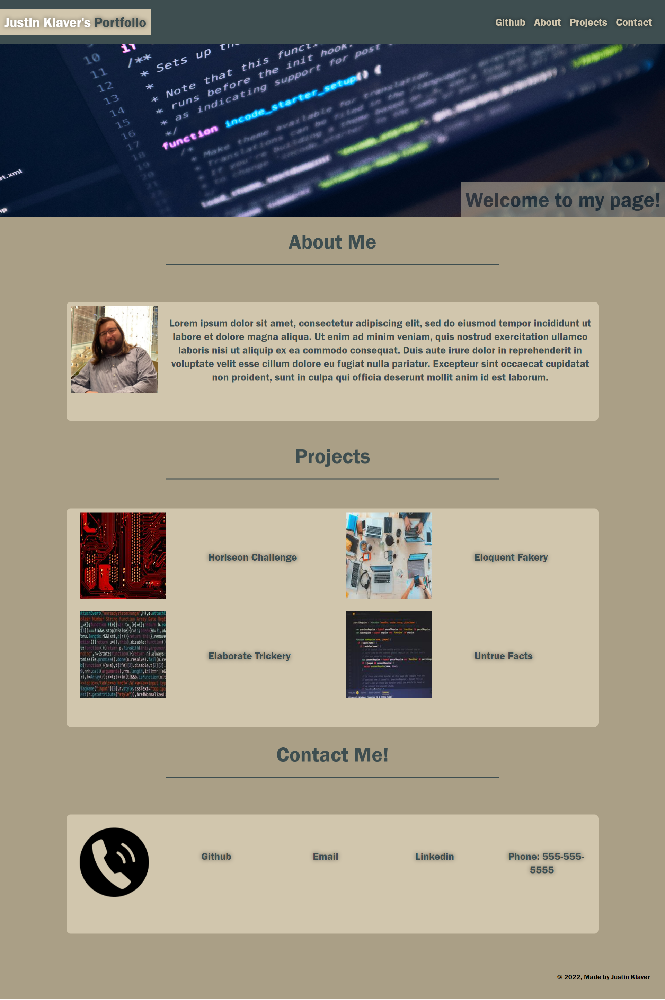

# Portfolio-Challenge2

## Table of Contents

- [Portfolio-Challenge2](#portfolio-challenge2)
  - [Table of Contents](#table-of-contents)
  - [Description](#description)
  - [Resources](#resources)
  - [Visuals](#visuals)
  - [Authors and Acknowledgments](#authors-and-acknowledgments)

## Description

The Challenge otwone assignment tasked us with creating a portfolio website using HTML as well as Advanced CSS learned during the week.

This was accomplished by using things like flexbox to design the site to be mobile friendly as well as using things like :root to create a design scheme to create a uniform color scheme.

## Resources

- [LIVE SITE](https://jklaver91.github.io/Portfolio-Challenge2/)

- [Repository](https://github.com/Jklaver91/Portfolio-Challenge2)

## Visuals

## Authors and Acknowledgments

Code created by Justin Klaver.